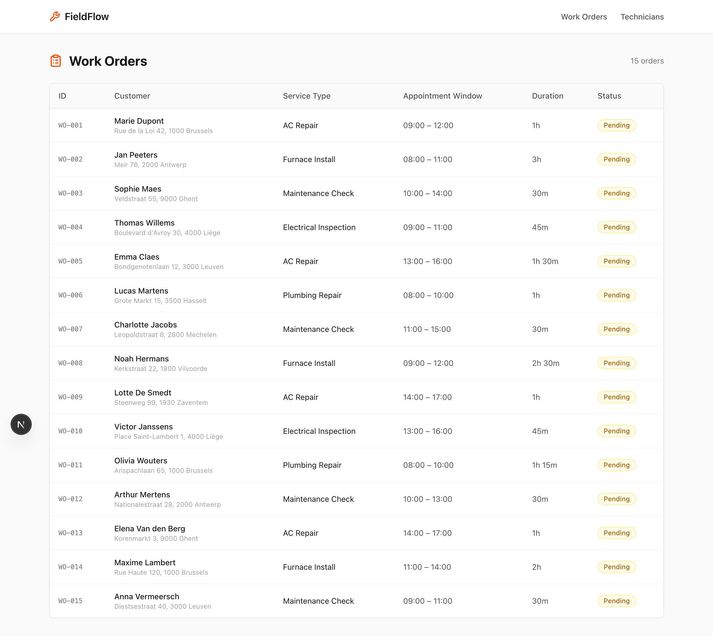
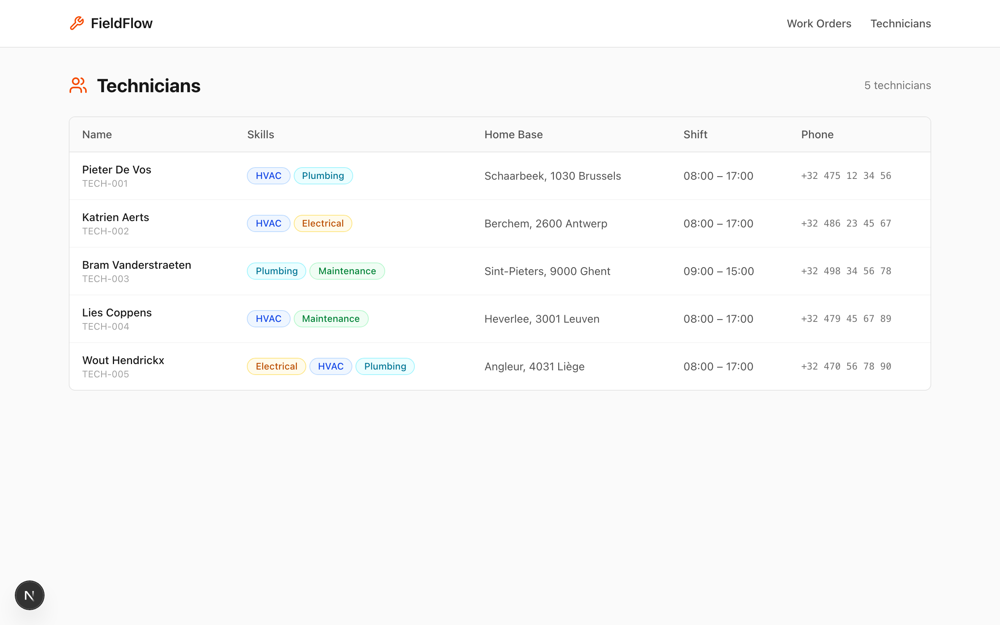

<p align="center">
  <strong>solvice/example-field-service</strong>
  <br>
  🔧 HVAC field service app — before & after the Solvice scheduler plugin
</p>

<p align="center">
  <a href="https://github.com/solvice/scheduler-plugin"></a>
  <a href="https://solvice.io"></a>
</p>

---

This is **FieldFlow**, a simple HVAC service management app. It demonstrates how the [Solvice scheduler plugin](https://github.com/solvice/scheduler-plugin) transforms a basic system of records into a full dispatch planning dashboard.

## 📸 Before — System of Records

A Next.js app with two pages: **Work Orders** and **Technicians**. No scheduling, no maps, no optimization.

### Work Orders

15 service requests across Belgium — AC repairs, furnace installs, maintenance checks, electrical inspections, plumbing jobs. Each has a customer, address, appointment window, and estimated duration.



### Technicians

5 field technicians with different skills (HVAC, Electrical, Plumbing, Maintenance), home bases, and shift hours. One technician has a shorter shift to create capacity pressure.



---

## 🚀 After — Dispatch Dashboard

> **Coming soon.** Run `/scheduler` against this repo to generate the dispatch view, then tag as `v1-after`.

---

## Quick Start

```bash
git clone https://github.com/solvice/example-field-service.git
cd example-field-service
pnpm install
pnpm dev
```

Open [http://localhost:3000](http://localhost:3000).

### Add scheduling with the Solvice plugin

```bash
# Install the plugin
claude plugin add github:solvice/scheduler-plugin

# Run the scheduler wizard
/scheduler
```

The plugin asks about your use case, tech stack, and domain language, then generates a complete dispatch dashboard with map, timeline, drag-and-drop, and real-time optimization.

---

## Git Tags

| Tag | Description |
|:----|:------------|
| `v0-before` | System of records — work orders + technicians tables |
| `v1-after` | *(coming)* Full dispatch dashboard generated by the plugin |

```bash
# See the before state
git checkout v0-before

# See the after state (once available)
git checkout v1-after
```

---

## Tech Stack

- [Next.js](https://nextjs.org) 15 (App Router)
- [TypeScript](https://typescriptlang.org)
- [Tailwind CSS](https://tailwindcss.com) v4
- [Lucide](https://lucide.dev) icons
- [Solvice VRP API](https://solvice.io) (after plugin)

## License

MIT
