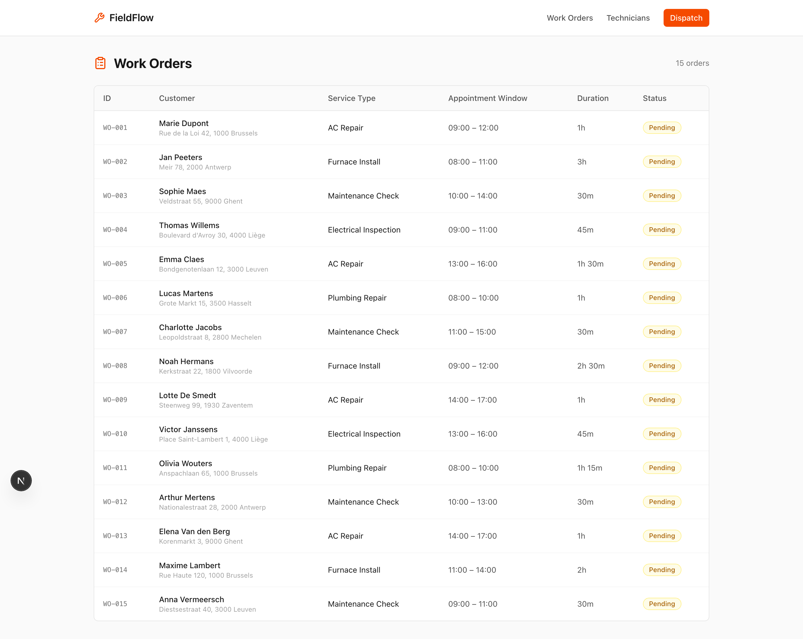
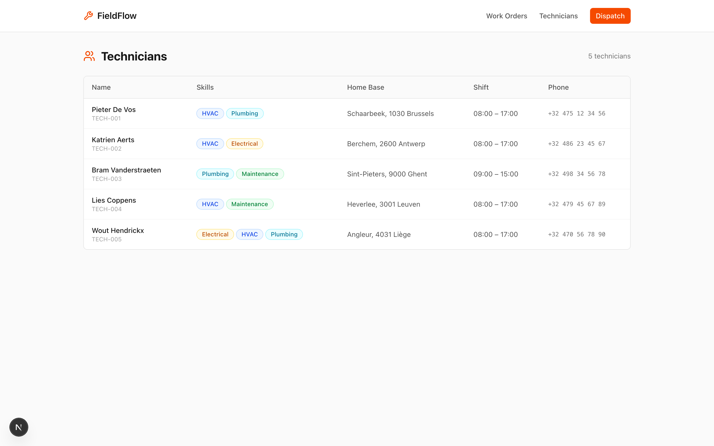
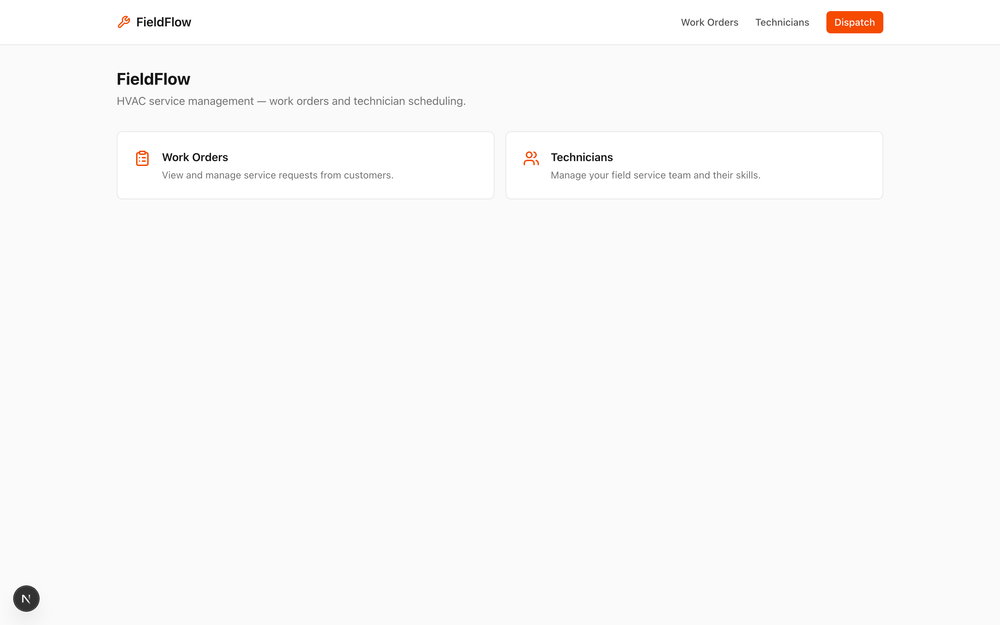
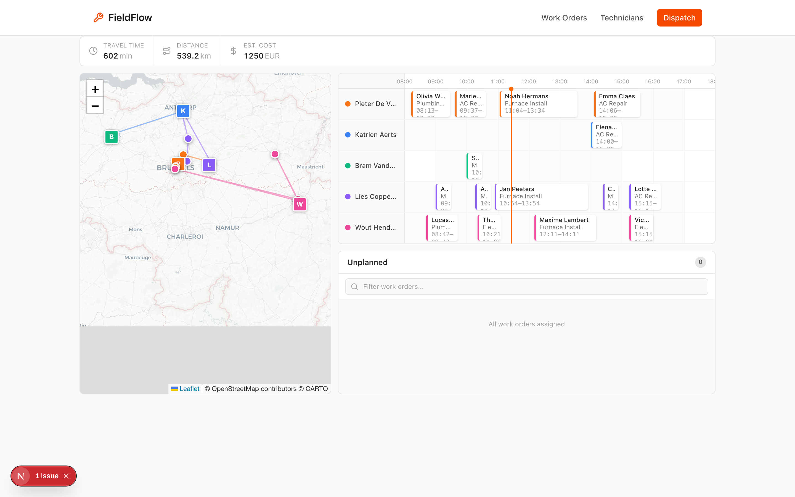
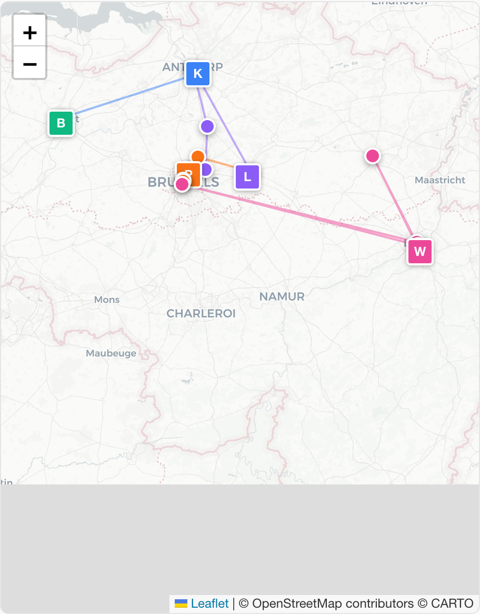
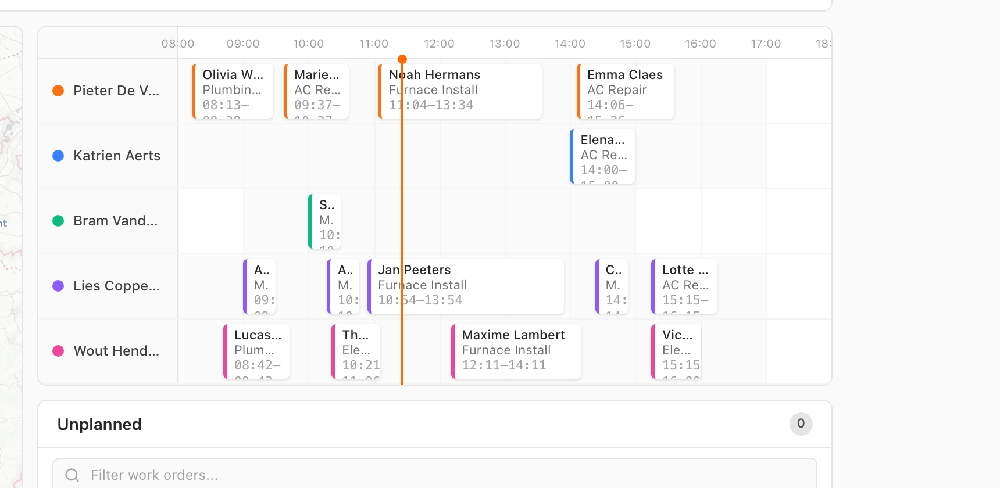
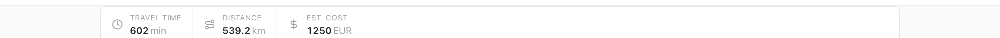

<p align="center">
  <strong>solvice/example-field-service</strong>
  <br>
  🔧 HVAC field service app — before & after the Solvice scheduler plugin
</p>

<p align="center">
  <a href="https://github.com/solvice/scheduler-plugin"></a>
  <a href="https://solvice.io"></a>
</p>

---

This is **FieldFlow**, a simple HVAC service management app that demonstrates how the [Solvice scheduler plugin](https://github.com/solvice/scheduler-plugin) transforms a basic system of records into a full dispatch planning dashboard.

**Two git tags tell the story:**

| Tag | What it is |
|:----|:-----------|
| [`v0-before`](https://github.com/solvice/example-field-service/tree/v0-before) | A simple CRUD app — work orders table + technicians table |
| [`v1-after`](https://github.com/solvice/example-field-service/tree/v1-after) | The same app with a full dispatch dashboard — map, timeline, drag-and-drop, real-time optimization |

---

## 📖 The Full Story

### Step 1 — Start with a system of records

FieldFlow is a basic Next.js app with two pages: **Work Orders** (15 HVAC service requests across Belgium) and **Technicians** (5 field workers with different skills and shift hours).

No scheduling. No maps. No optimization. Just tables.





---

### Step 2 — Install the Solvice scheduler plugin

```bash
claude plugin add github:solvice/scheduler-plugin
```

---

### Step 3 — Run `/scheduler`

The plugin starts an interactive conversation. It asks 6 questions:

> **1. What are you dispatching?**
> → Field service technicians (HVAC)
>
> **2. What framework are you using?**
> → React / Next.js (already set up)
>
> **3. Do you have a Solvice API key?**
> → Yes, added to `.env`
>
> **4. What do you call your "jobs" and "resources"?**
> → "Work Orders" and "Technicians" — with service types, appointment windows, customer names
>
> **5. Which views do you need?**
> → Map + Timeline + Unplanned queue + KPI dashboard
>
> **6. Map library preference?**
> → Leaflet (lightweight, works everywhere)

---

### Step 4 — The plugin proposes an architecture

Before writing any code, the plugin presents a design:

```
Domain Mapping:
  Work Order       → Solvice Job
  Technician       → Solvice Resource
  Service Type     → Solvice Tag
  Appointment Window → Solvice TimeWindow

Components to generate:
  1. Types — WorkOrderAssignment, DispatchMetrics, DistanceMatrix
  2. API client — solvice-client.ts (maps your terms ↔ Solvice types)
  3. State — DispatchProvider (React context + reducer)
  4. Logic — distance-matrix.ts, sequencing.ts, format.ts
  5. UI — DispatchMap, DispatchTimeline, UnplannedQueue, DispatchKpiBar
  6. Page — /dispatch route composing everything
```

You confirm, and it generates.

---

### Step 5 — The dispatch dashboard appears

The plugin generates all the code and a new **Dispatch** button appears in the nav:



Click it, and the Solvice solver optimizes all 15 work orders across 5 technicians:



---

### What you see

#### 🗺️ Map — Routes across Belgium

Technician home bases (colored squares with initials), work order locations (colored dots), and optimized route polylines connecting each technician's assigned work orders.



#### 📊 Timeline — Gantt-style schedule

Each row is a technician. Colored blocks show assigned work orders positioned by arrival time, sized by service duration. Customer name, service type, and time visible on each block.



#### 📈 KPI Bar — Real-time metrics

Travel time, distance, and estimated cost — updated live as the solver optimizes.



#### 📋 Unplanned Queue

All 15 work orders assigned — queue shows 0 unplanned. If any work order couldn't be assigned (skill mismatch, capacity), it would appear here as a draggable card.

---

### What the plugin generated

| Layer | Files | What it does |
|:------|:------|:-------------|
| **Types** | `lib/dispatch/types.ts` | WorkOrderAssignment, ScheduleViolation, DispatchMetrics, DistanceMatrix |
| **API client** | `lib/dispatch/solvice-client.ts` | Maps Work Order ↔ Job, Technician ↔ Resource. Only layer that knows Solvice API types. |
| **API routes** | `app/api/dispatch/solve/`, `evaluate/`, `matrix/` | Server-side proxies to Solvice VRP API |
| **Pure logic** | `lib/dispatch/distance-matrix.ts`, `sequencing.ts`, `format.ts` | O(1) travel lookups, cascaded arrival computation, display formatting |
| **State** | `components/dispatch/DispatchProvider.tsx` | React context + reducer with undo support |
| **Hooks** | `hooks/useDistanceMatrix.ts`, `useSchedulerEvaluate.ts`, `useDragAndDrop.ts` | Matrix caching, two-tier evaluation, drag-and-drop orchestration |
| **UI** | `DispatchMap.tsx`, `DispatchTimeline.tsx`, `UnplannedQueue.tsx`, `DispatchKpiBar.tsx` | Map markers + polylines, Gantt timeline, draggable queue, live metrics |
| **Page** | `app/dispatch/page.tsx` | Composes everything into a full-screen dispatch view |

**Everything uses your domain language.** The code says `WorkOrder`, `Technician`, `technicianId`, `serviceType` — never `Job`, `Resource`, or `tag`. The Solvice API mapping is isolated in `solvice-client.ts`.

---

## 🚀 Quick Start

```bash
git clone https://github.com/solvice/example-field-service.git
cd example-field-service
pnpm install
```

Add your Solvice API key:

```bash
cp .env.example .env
# Edit .env and add your SOLVICE_API_KEY
```

Run:

```bash
pnpm dev
```

Open [http://localhost:3000](http://localhost:3000) → click **Dispatch**.

### Compare before and after

```bash
# See the "before" — just tables
git checkout v0-before
pnpm dev

# See the "after" — full dispatch dashboard
git checkout v1-after
pnpm dev
```

---

## 🏗️ Build your own

Don't want field service? Build a scheduler for **your** domain:

```bash
# Install the plugin
claude plugin add github:solvice/scheduler-plugin

# Run the wizard in your project
/scheduler
```

The plugin asks about your use case, adapts to your terminology, and generates a complete dispatch dashboard for your framework.

---

## 🛠️ Tech Stack

| Before (`v0`) | After (`v1`) |
|:--------------|:-------------|
| Next.js 15 | + Leaflet (map) |
| TypeScript | + @dnd-kit (drag-and-drop) |
| Tailwind CSS v4 | + Solvice VRP API |
| Lucide icons | + Distance matrix caching |
| | + Two-tier evaluation |
| | + Cascaded arrival sequencing |

## 📄 License

MIT
